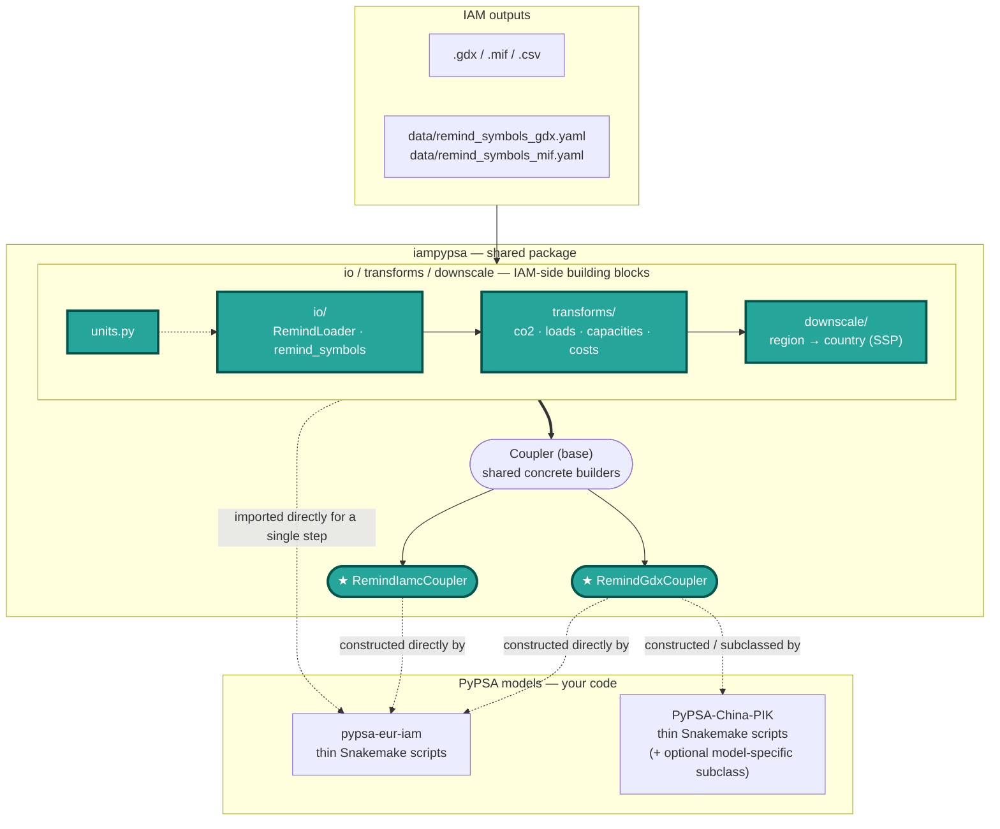

# Architecture

`iampypsa` is the **shared layer** of the IAM ↔ PyPSA soft-coupling. It provides backend
functions *that are needed* by all PyPSA models that couple to an IAM (reading IAM
output, unit conversion, downscaling, the demand/cost/capacity/CO2 transforms) behind a small,
stable interface: `Coupler`.

Guiding rule:

> **IAM-side logic lives in the package. PyPSA-side logic lives in the model.**
> `Coupler` is the seam where the two meet.

!!! info "Symbols"
    "Symbol" is the GAMS name for sets, scalars, parameters and variables — these are the
    REMIND outputs that `iampypsa` reads.

---

## Workflow



Everything in `iampypsa` is public — `io`, `transforms`, and `downscale` are not hidden
implementation details. `Coupler` is the recommended entry point for a full pipeline step (it
orchestrates loading, converting, and transforming in one call), but real integrations also
import `io`/`transforms`/`downscale` functions directly for a single step — see
[Integrating a PyPSA model](getting-started/integrating-a-model.md)'s step list, or
`pypsa-eur-iam`'s `downscale_REMIND_demand.py`, which calls `iampypsa.downscale` functions
directly rather than going through a `Coupler`. Data generally flows **load → convert →
transform → (downscale) → hand to the model**, whether that's orchestrated by a `Coupler` call
or assembled step-by-step in the model's own Snakemake rules.

---

## What lives where

### In the package (`iampypsa`) — shared, model-agnostic

| Subpackage | Component | Responsibility |
|---|---|---|
| `io/` | `loader.RemindLoader` | Open an IAM source and resolve/read symbols. Backend (`gdx` via `gamspy`, or `iamc` `.mif`/`.csv`) is auto-detected; `lru`-cached. |
| `io/` | `remind_symbols` (+ `data/remind_symbols_gdx.yaml` / `data/remind_symbols_mif.yaml`) | Map **coupling names** — iampypsa's own stable names for a quantity (`co2_price`, `capacity`, `tech_data`, …) → the actual IAM symbol name(s), plus the unit each carries. `load_frame()` / `load_set()` read a symbol and apply the declared unit conversion. |
| `io/` | `technology_mapping` | Parse the model's technology-mapping YAML into a `{parameter: source}` map per technology — see [Technology mapping](getting-started/technology-mapping.md). |
| `io/` | `ssp` | Fetch / read the SSP population & GDP proxy datasets used by downscaling. |
| `units` | `units.py` | Unit conversions `(from_unit, to_unit) → factor`. |
| `transforms/` | `co2_prices`, `loads`, `capacities`, `costs` | Pure functions on already-loaded long-format tables. They never read files and never know IAM symbol names. |
| `downscale/` | `demand`, `proxy`, `base` | Region → country disaggregation via SSP/degree-day proxy shares. |
| `couplers/` | `base.Coupler` | The interface + shared concrete builders (CO2 prices, country demand, discount rates). |
| `couplers/` | `remind.RemindGdxCoupler`, `remind.RemindIamcCoupler`, `remind.read_region_map` | REMIND's two `Coupler` subclasses (GDX / IAMC backends), and the REMIND region↔country CSV reader. |
| *(root)* | `validate` | Check the config's declared scenario (regions/years) actually exists in the IAM source before a run. |

### In the PyPSA repo — Snakemake glue (and, optionally, a subclass)

The model's own thin Snakemake rules, which construct a `Coupler` subclass and call its methods.
Most of what used to require a per-model adapter subclass is now just constructor arguments:

- The **paths, scenario logic, sector definitions** — these stay entirely in the model's own
  Snakemake/config and never leak into the package.
- **Model-specific tweaks**, when a model genuinely needs one (e.g. an extra demand-calibration
  step), go into a further `Coupler` subclass in the model repo — optional, not required.

---

## The `Coupler` interface

`Coupler.__init__` binds the shared inputs:

```python
coupler = RemindGdxCoupler(
    loader=RemindLoader(remind_gdx_path),       # the REMIND source
    symbols=load_symbol_specs(backend="gdx"),   # coupling-name → REMIND symbol map (+ region overrides)
    region_map=read_region_map(),               # REMIND region → [country, ...]
    config=coupling_config,                     # the model's coupling config dict
    model_regions=[...],                        # REMIND regions in scope
    reference_data={"population": pop_df, "gdp": gdp_df},  # proxies for downscaling
)
```

Methods, grouped by whether they're IAM-specific or shared:

| Method | Kind | Override when… |
|---|---|---|
| `build_regional_demand()` | **hook** — must implement per IAM backend | always, for a new IAM/backend. `RemindGdxCoupler`/`RemindIamcCoupler` already implement this for REMIND. |
| `extract_cost_parameters(year)` | **hook** — must implement per IAM backend | always, for a new IAM/backend. Same as above. |
| `build_co2_prices(years=None)` | concrete, inherited | rarely — only if the model's CO2 handling diverges. |
| `downscale_country_demand(regional=None)` | concrete, inherited | the model needs extra steps (e.g. a historical-calibration adjustment). |
| `build_discount_rates(year)` | concrete, inherited | rarely. |

---

## Symbols & units: configure, don't code

`data/remind_symbols_gdx.yaml` / `data/remind_symbols_mif.yaml` decouple the package from
the IAM's symbol names and units, one file per backend. These can be overwritten in the PyPSA
model's thin coupling layer.

Each top-level key in the YAML (`co2_price`, `capacity`, `tech_data`, …) is a **coupling
name**: iampypsa's own stable name for a quantity. The coupling code only ever refers to a
quantity by its coupling name (`self.symbols["co2_price"]`); the YAML maps that name to the
actual IAM symbol name(s). This is *not* the PyPSA carrier name — that mapping happens
later, in the [technology mapping](getting-started/technology-mapping.md). The indirection means
a symbol can be renamed or reversioned by the IAM (REMIND's `v32_taxCO2eq` → `p_priceCO2` is one
real example), or a region can expose a different one entirely, without touching any code — only
the YAML changes.

A **single-quantity** symbol — candidate list (first present wins), column renames, source
unit(s) and target unit:

```yaml
co2_price:
  symbol: [v32_taxCO2eq, p_priceCO2]   # try v32_… first, fall back to p_priceCO2
  rename: {tall: year, all_regi: region}
  units: [$/tC, $/tC]                  # per-candidate source unit
  to_unit: $/tCO2                      # load_frame() applies the (units, to_unit) factor
```

A **mixed-unit set** — one IAM symbol whose `index` column selects several quantities
with different units:

```yaml
tech_data:
  symbol: pm_data
  rename: {all_regi: region, all_te: technology}
  index: char
  schema:
    lifetime: {parameter: lifetime, unit: yr,     to_unit: yr}
    omf:      {parameter: FOM,      unit: p.u.,   to_unit: "%/yr"}
    omv:      {parameter: VOM,      unit: T$/TWa, to_unit: $/MWh}
```

Per-region differences go under `overrides:` (e.g. `CHA:`) and need to list **only the entries
that differ** — everything else is inherited from `default:`. Resolve with
`load_symbol_specs(region="CHA", backend="gdx")`.

Two layering mechanisms let a model adjust symbols without forking the package:

- `load_symbol_specs(path=…)` or the `IAMPYPSA_SYMBOLS` env var — overlay a model-local YAML
  on top of the packaged default.
- the `overrides:` block — per-IAM-region deltas inside one config.

**The unit conversion contract:** `load_frame`/`load_set` apply the declared conversion *at
the moment of loading* (the "Coupler seam"). The downstream transforms are therefore called
with conversion disabled so units are never applied twice. Add a new conversion by adding one
row to `UNIT_CONVERSIONS` in `units.py` — never as a literal in a transform or a rule.

---

## Transforms

`transforms/` is the **stateless compute layer**. Each function takes an already-loaded,
already-unit-converted long-format table (canonical columns `region`, `year`, `value`, …) and
returns one. They never touch the filesystem and never reference an IAM symbol name — that
is the loader's job — which makes them trivially unit-testable and reusable across models.

Because conversion happens at the load seam (above), transforms are invoked with conversion
already applied — they don't re-scale a quantity.

| Module | Key functions | Does |
|---|---|---|
| `co2_prices` | `extract_co2_prices`, `convert_co2_prices` | Filter/reindex the CO2 price pathway to the coupled `regions × years` grid (missing → 0); apply the currency factor. |
| `loads` | `convert_loads` | Reduce IAM demand to one tidy row per `(year, region, sector)` in annual MWh. |
| `capacities` | `prepare_capacities`, `apply_consolidation`, `adjust_link_capacities_to_input`, `aggregate_capacities_to_carriers`, `build_capacity_targets` | Read + consolidate (VRE-variant merge, battery scaling) tidy capacities; divide link-like techs by efficiency (output→input basis); map IAM techs to PyPSA carriers and sum to capacity targets. |
| `costs` | `build_iam_techdata`, `build_pypsa_techdata`, `build_set_value_overrides`, `apply_overrides`, `add_discount_rate`, `convert_investment_to_input_capacity_basis` | Split cost values by [technology-mapping](getting-started/technology-mapping.md) source, merge IAM values onto the PyPSA baseline, convert investment from per-output to per-input capacity (`× efficiency ** exp`), add discount-rate rows. |

The `Coupler`'s `build_*` / `extract_*` methods and the `transforms/capacities` entry point
(`build_capacity_targets`) are thin orchestrations over these functions; each function is
documented individually in the **Reference** section of the nav.

---

## Downscaling

`downscale/` turns the IAM's **regional** demand into **country-level** demand — spatial
downscaling only; capacities aren't downscaled this way (see
[Harmonising capacities](getting-started/harmonising-capacities.md) for how those are handled
instead). The split uses SSP population/GDP proxy shares (and degree-day-weighted proxies for
heating-sensitive sectors), applied per `(region, year, sector)` row via
`Coupler.downscale_country_demand()`.

See **[Downscaling demand](getting-started/downscaling-demand.md)** for the full walkthrough —
why it's needed, the proxy mechanism, edge cases, and how it relates to the *temporal*
downscaling (annual → hourly) that happens on the model side, outside this package.
