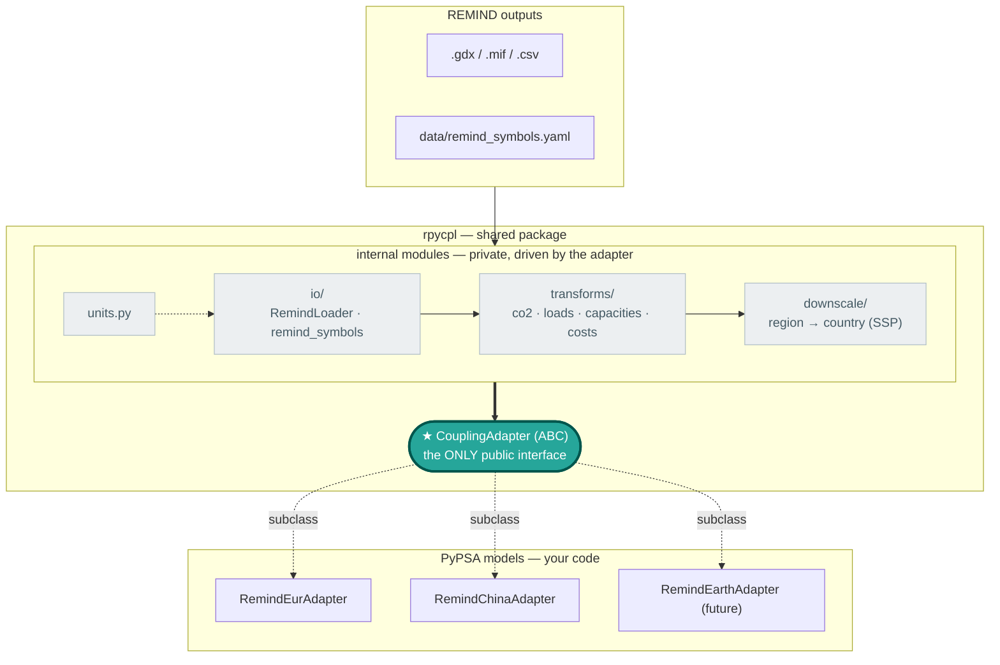

# Architecture

`rpycpl` is the **shared layer** of the REMIND ↔ PyPSA soft-coupling. It provides backend
functions *that are needed* by all PyPSA models that couple to REMIND (reading REMIND
output, unit conversion, downscaling, the cost/capacity/load/CO₂ transforms) behind a small,
stable interface.

Model-specific functions live in a thin **adapter** inside each PyPSA repo (PyPSA-Eur,
PyPSA-China, later PyPSA-Earth), which subclasses the package's `CouplingAdapter`. The
adapter subclass design is driven by that model's own Snakemake rules.

The guiding rule:

> **REMIND-side logic lives in the package. PyPSA-side logic lives in the model.**
> The adapter is the only seam where the two meet.

This page is the conceptual map: how the components fit, what lives where, and the adapter
interface. For the hands-on guide — writing an adapter, wiring the Snakemake rules, adding a
new model — see **[Plugging into a PyPSA workflow](workflow.md)**.


!!! info "Symbols"
    "Symbol" is the GAMS name for sets, scalars, parameters and variables — these are the
    REMIND outputs that `rpycpl` reads.

---

## How the pieces fit together



The boundary is deliberate: **`CouplingAdapter` is the only public surface.** Models subclass
it and call its methods; everything inside `internal` (`io`, `units`, `transforms`,
`downscale`) is an implementation detail the adapter orchestrates — model code never imports
those modules directly. Data flows one way: **load → convert → transform → (downscale) → hand
to the model** via the adapter, whose methods the model's Snakemake rules call to write
outputs into the model's own resource paths.

---

## What lives where

### In the package (`rpycpl`) — shared, model-agnostic

| Subpackage | Component | Responsibility |
|---|---|---|
| `io/` | `loader.RemindLoader` | Open a REMIND source and resolve/read symbols. Backend (`gdx` via `gamspy`, or `iamc` `.mif`/`.csv`) is auto-detected; `lru`-cached. |
| `io/` | `remind_symbols` (+ `data/remind_symbols.yaml`) | Map **coupling names** — rpycpl's own stable names for a quantity (`co2_price`, `capacity`, `tech_data`, …) → the actual REMIND symbol name(s), plus the unit each carries. `load_frame()` / `load_set()` read a symbol and apply the declared unit conversion. |
| `io/` | `ssp` | Fetch / read the SSP population & GDP proxy datasets used by downscaling. |
| `units` | `units.py` | Single source of truth for every `(from_unit, to_unit) → factor`. |
| `transforms/` | `co2_prices`, `loads`, `capacities`, `costs`, `mapping` | Pure functions on already-loaded **tidy frames**. They never read files and never know REMIND symbol names. |
| `downscale/` | `demand`, `proxy`, `base` | Region → country disaggregation via SSP population/GDP proxy shares. |
| `adapters/` | `base.CouplingAdapter` | The interface + a working **default** REMIND→PyPSA pipeline (CO₂ prices, country demand, capacity floors, cost extraction). |
| *(root)* | `validate` | Check the config's declared scenario (regions/years) actually exists in the REMIND source before a run. |

### In the PyPSA repo — the adapter + Snakemake glue

A concrete adapter (e.g. `RemindEurAdapter`) and the model's thin Snakemake rules. The
adapter holds **only** what genuinely differs for that model:

- The **config-key structure** to patch (the one thing every model must define).
- Any **model-specific tweaks** to the otherwise-shared pipeline (efficiency quirks,
  capacity pre-processing, historical calibration).
- The model's **paths, scenario logic, sector definitions** — these stay entirely in the
  model's own Snakemake/config and never leak into the package.

---

## The adapter interface

`CouplingAdapter.__init__` is the interface to the PyPSA model and binds the shared inputs:

```python
adapter = RemindEurAdapter(
    loader=RemindLoader(remind_gdx_path),   # the REMIND source
    symbols=load_symbol_specs(region=None), # coupling-name → REMIND symbol map (+ region overrides)
    region_map={...},                       # REMIND region → [country, ...]
    config=coupling_config,                 # the model's coupling config dict
    remind_regions=[...],                   # REMIND regions in scope
    reference_data={"population": pop_df, "gdp": gdp_df},  # proxies for downscaling
)
```

Methods, grouped by who owns them:

| Method | Kind | Override when… |
|---|---|---|
| `build_config_overrides()` | **abstract**| **always** (must implement) — the config-key *structure* differs per workflow. This is the only method you *must* implement. |
| `build_co2_prices()` | concrete | rarely — only if the model's CO₂ handling diverges. |
| `downscale_country_demand()` | concrete | the model needs extra steps (e.g. China's historical calibration). |
| `determine_must_build_capacity(tech_map)` | concrete | rarely. This is the REMIND capacity that the PyPSA model must build for consistency |
| `extract_cost_parameters(year)` | concrete | only if the model's REMIND cost interface genuinely diverges. |
| `build_costs(year, tech_map, baseline)` | concrete | rarely. |
| `prepare_capacities(caps)` | **hook** (identity default) | the model has REMIND techs needing pre-processing (EUR: VRE-variant merge + battery scaling; China: none). |
| `adjust_cost_efficiencies(eff)` | **hook** (identity default) | the model has an efficiency quirk (EUR: square `btin`). |

`reference_data` is an open dict of named proxy frames; `adapter.ssp_population` and
`adapter.ssp_gdp` are read-only convenience views onto it. Pass other proxies (e.g. a custom
load-distribution key) under additional names without changing the base class.

### Why only `build_config_overrides` is abstract

Every other builder is **REMIND-side** — the logic is identical regardless of which PyPSA
model consumes it, so it is inherited. Only the *shape* of the config patch (which keys the
model expects: `scenario.planning_horizons`, `co2_prices`, `run.remind.*`, …) is intrinsic
to the workflow, so it must be supplied. This keeps adapters tiny.

---

## Symbols & units: configure, don't code

`data/remind_symbols.yaml` decouples the package from REMIND's symbol names and units. These
can be overwritten in the PyPSA model's thin coupling layer.

Each top-level key in the YAML (`co2_price`, `capacity`, `tech_data`, …) is a **coupling
name**: rpycpl's own stable name for a quantity. The coupling code only ever refers to a
quantity by its coupling name (`self.symbols["co2_price"]`); the YAML maps that name to the
actual REMIND symbol name(s). This is *not* the PyPSA carrier name — that mapping happens
later, in the tech/carrier CSV. The indirection means REMIND can rename or version a symbol
(`v32_taxCO2eq` → `p_priceCO2`), or a region can expose a different one, without touching any
code: only the YAML changes.

A **single-quantity** symbol — candidate list (first present wins), column renames, source
unit(s) and target unit:

```yaml
co2_price:
  symbol: [v32_taxCO2eq, p_priceCO2]   # try v32_… first, fall back to p_priceCO2
  rename: {tall: year, all_regi: region}
  units: [$/tC, $/tC]                  # per-candidate source unit
  to_unit: $/tCO2                      # load_frame() applies the (units, to_unit) factor
```

A **mixed-unit set** — one REMIND symbol whose `index` column selects several quantities
with different units:

```yaml
tech_data:
  symbol: pm_data
  rename: {all_regi: region, all_te: technology}
  index: char
  schema:
    lifetime: {parameter: lifetime, unit: yr,     to_unit: yr}
    omf:      {parameter: FOM,      unit: p.u.,   to_unit: "%/yr"}
    omv:      {parameter: VOM,      unit: T$/TWa, to_unit: $/MWh}
```

Per-region differences go under `overrides:` (e.g. `CHA:`) and need list **only the entries
that differ** — everything else is inherited from `default:`. Resolve with
`load_symbol_specs(region="CHA")`.

Two layering mechanisms let a model adjust symbols without forking the package:

- `load_symbol_specs(path=…)` or the `RPYCPL_SYMBOLS` env var — overlay a model-local YAML
  on top of the packaged default.
- the `overrides:` block — per-REMIND-region deltas inside one config.

**The unit conversion contract:** `load_frame`/`load_set` apply the declared conversion *at
the moment of loading* (the "adapter seam"). The downstream transforms are therefore called
with conversion disabled (`carbon_to_co2=False`, `unit_factor=1.0`) so units are never
applied twice. Add a new conversion by adding one row to `UNIT_CONVERSIONS` in `units.py` —
never as a literal in a transform or a rule.

---

## Transforms

`transforms/` is the **stateless compute layer**. Each function takes an already-loaded,
already-unit-converted tidy frame (canonical columns `region`, `year`, `value`, …) and
returns one. They never touch the filesystem and never reference a REMIND symbol name — that
is the loader's job — which makes them trivially unit-testable and reusable across models.

Because conversion happens at the load seam (above), transforms are invoked with conversion
**disabled** (`carbon_to_co2=False`, `unit_factor=1.0`) so a quantity is never scaled twice.

| Module | Key functions | Does |
|---|---|---|
| `co2_prices` | `extract_co2_prices`, `convert_co2_prices` | Filter/reindex the CO₂ price pathway to the coupled `regions × years` grid (missing → 0); apply the currency factor. |
| `loads` | `convert_loads` | Reduce REMIND demand to one tidy row per `(year, region, sector)` in annual MWh. |
| `capacities` | `convert_capacities`, `adjust_link_capacities_to_input`, `aggregate_capacities_to_carriers` | Tidy capacities → MW; divide link-like techs by efficiency (output→input basis); map REMIND techs to PyPSA carriers and sum to `p_nom_min`. |
| `costs` | `build_cost_overrides`, `convert_investment_to_input_capacity_basis`, `add_discount_rate`, `merge_cost_overrides_into_baseline` | Map REMIND cost values onto PyPSA carriers, convert investment from per-output to per-input capacity (`× efficiency ** exp`), add discount-rate rows, and merge onto the PyPSA baseline cost table. |
| `mapping` | `read_region_map` | Read the REMIND region ↔ country CSV (ISO3→ISO2, `;`-separated) into `{region: [country, …]}`. |

The adapter's `build_*` / `extract_*` methods are thin orchestrations over these functions;
each function is documented individually in the **Reference** section of the nav.

---

## Downscaling

`downscale/` turns REMIND's **regional** quantities into the **country-level** quantities a
PyPSA model needs. REMIND regions are aggregates (e.g. `EUR`, `CHA`); a model that runs at
country resolution must split a region's value across its member countries.

The split uses **SSP proxy shares** — normalised population and GDP projections (fetched or
read via `io.ssp`) blended per sector. Mechanics:

- `proxy.build_ssp_shares` returns `{country: share}` for a region/year/sector: a
  sector-specific blend of normalised GDP and population (`DEFAULT_AC_WEIGHTS` =
  `{gdp: 0.6, population: 0.4}` for unknown sectors). SSP years are clamped to the last
  available; shares sum to 1 within each region.
- `demand.disaggregate_demand_to_country` applies those shares to every
  `(year, region, sector)` row. **Single-member regions are a no-op.** Demand for countries
  not configured in the model is dropped (with a warning if it exceeds 1% of the region's
  demand). Missing SSP data for a *configured* country raises; for an unconfigured one it
  gets zero weight.
- `base.ProportionalDownscaler` is the generic engine behind this — multiply a coarse value
  by its members' proxy shares — usable for any coarse→fine split, not just demand.

Nothing here hardcodes a region set or country list: the region→country map and the proxy
tables are supplied by the caller (the adapter), which is what keeps the layer reusable for
PyPSA-Earth's much wider coverage.
