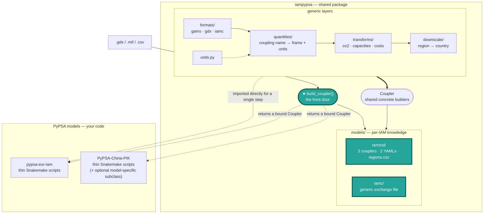

# Architecture

`iampypsa` is the **shared layer** of the IAM ↔ PyPSA soft-coupling. It provides backend
functions *that are needed* by all PyPSA models that couple to an IAM (reading IAM
output, unit conversion, downscaling, the demand/cost/capacity/CO2 transforms) behind a small,
stable interface: `Coupler`.

Guiding rule:

> **IAM-side logic lives in the package. PyPSA-side logic lives in the model.**
> `Coupler` is the seam where the two meet.

!!! info "Quantities vs symbols"
    A **quantity** is a coupling name — iampypsa's own stable name for something PyPSA needs
    (`co2_price`, `capacity`, `tech_data`). A **symbol** is GAMS's word for a set, scalar,
    parameter or variable in a GDX file; IAMC calls its equivalent a *variable*. The
    `quantities/` layer maps the former onto the latter, so "symbol" appears only in
    `formats/gdx.py`, where it is the right word.

---

## Workflow



`build_coupler()` is the entry point: it detects the source's format, picks the coupler and
packaged quantity specs for that model and backend, and hands back a bound `Coupler`. That
pairing used to be repeated by hand in every consumer script.

The layers below it are importable and documented, but they are internals — reach past the
facade deliberately, for a single step, the way `pypsa-eur-iam`'s `downscale_REMIND_demand.py`
calls `iampypsa.downscale` directly. Data flows **load → convert → transform → (downscale) →
hand to the model**, whether orchestrated by a `Coupler` call or assembled step-by-step in the
model's own Snakemake rules.

---

## What lives where

### In the package (`iampypsa`) — shared, model-agnostic

| Module | Component | Responsibility |
|---|---|---|
| `__init__` | `build_coupler` | The front door: detect the format, pair it with the model's coupler + packaged specs, return a bound `Coupler`. |
| `loader.py` | `IamLoader` | Bind one source and resolve names in it: `backend`, `list_names()`, `resolve()`, `read()`. Nothing else — no units, no spec shapes. |
| `formats/` | `gdx`, `gams`, `iamc` | One module per container/data model. `gdx` reads the container; `gams` owns set-indexed symbols (`load_indexed`); `iamc` owns the `.mif` model (`read_iamc`, `load_variables`). Each declares the spec shapes it can serve. |
| `quantities/` | `config`, `load`, `conversion`, `schema` | Map **coupling names** (`co2_price`, `capacity`, `tech_data`, …) to source name(s) + units, layer the YAML, and apply the declared conversion. `load_quantity()` is the single public entry. |
| `models/` | `MODELS` registry, `remind/`, `iamc/` | Everything IAM-specific: couplers, quantity YAMLs, region maps. Nothing outside `models/` may name an IAM. |
| `coupler.py` | `Coupler` | The interface + shared concrete builders (CO2 prices, country demand, discount rates, capacities). |
| `transforms/` | `co2_prices`, `capacities`, `costs` | Pure functions on already-loaded long tables. They never read files and never know IAM symbol names. |
| `downscale/` | `demand`, `proxy` | Region → country disaggregation via SSP/degree-day proxy shares. |
| `reference/` | `ssp`, `degree_days` | External reference datasets used as downscaling proxies — not IAM output. |
| `units.py` | `UNIT_CONVERSIONS` | Unit conversions `(from_unit, to_unit) → factor`. An undeclared pair raises. |

### In the PyPSA repo — Snakemake glue (and, optionally, a subclass)

The model's own thin Snakemake rules, which construct a `Coupler` subclass and call its methods.
Most of what used to require a per-model adapter subclass is now just constructor arguments:

- The **paths, scenario logic, sector definitions** — these stay entirely in the model's own
  Snakemake/config and never leak into the package.
- **Model-specific tweaks**, when a model genuinely needs one (e.g. an extra demand-calibration
  step), go into a further `Coupler` subclass in the model repo — optional, not required.

---

## The `Coupler` interface

`Coupler.__init__` binds the shared inputs:

```python
from iampypsa import build_coupler

coupler = build_coupler(
    remind_gdx_path,                                       # backend detected from the suffix
    model="remind",                                        # picks the coupler + packaged specs
    config=coupling_config,                                # the model's coupling config dict
    model_regions=[...],                                   # IAM regions in scope
    reference_data={"population": pop_df, "gdp": gdp_df},  # proxies for downscaling
)
```

`region_map` defaults to the model's packaged region → country map; pass one to override it.
Construct a coupler directly (`RemindGdxCoupler(loader, quantities, region_map, config)`) when
you need to bypass the registry — the factory is a convenience, not a gate.

Methods, grouped by whether they're IAM-specific or shared:

| Method | Kind | Override when… |
|---|---|---|
| `build_regional_demand()` | **hook** — must implement per IAM backend | always, for a new IAM/backend. `models/remind/` and `models/iamc/` already implement it. |
| `extract_cost_parameters(year)` | **hook** — must implement per IAM backend | always, for a new IAM/backend. Same as above. |
| `build_co2_prices(years=None)` | concrete, inherited | rarely — only if the model's CO2 handling diverges. |
| `downscale_country_demand(regional=None)` | concrete, inherited | the model needs extra steps (e.g. a historical-calibration adjustment). |
| `build_discount_rates(year)` | concrete, inherited | rarely. |
| `prepare_capacities()` | concrete, inherited | rarely — capacities at model-tech resolution, before carrier aggregation. |
| `get_capacities(tech_map, …)` | concrete, inherited | rarely — the same, aggregated to the model's PyPSA carriers. |

---

## Quantities & units: configure, don't code

`models/remind/quantities_gdx.yaml` / `quantities_mif.yaml` decouple the package from the IAM's
symbol names and units, one file per backend. These can be overlaid from the PyPSA model's thin
coupling layer.

Each top-level key in the YAML (`co2_price`, `capacity`, `tech_data`, …) is a **coupling
name**: iampypsa's own stable name for a quantity. The coupling code only ever refers to a
quantity by its coupling name (`self.quantities["co2_price"]`); the YAML maps that name to the
actual IAM symbol name(s). This is *not* the PyPSA carrier name — that mapping happens
later, in the [technology mapping](getting-started/technology-mapping.md). The indirection means
a symbol can be renamed or reversioned by the IAM (REMIND's `v32_taxCO2eq` → `p_priceCO2` is one
real example), or a region can expose a different one entirely, without touching any code — only
the YAML changes.

A **single-quantity** symbol — candidate list (first present wins), column renames, source
unit(s) and target unit:

```yaml
co2_price:
  symbol: [v32_taxCO2eq, p_priceCO2]   # try v32_… first, fall back to p_priceCO2
  rename: {tall: year, all_regi: region}
  units: [USD/tC, USD/tC]              # per-candidate source unit
  to_unit: USD/tCO2                    # load_simple() applies the (units, to_unit) factor
```

A **mixed-unit set** — one IAM symbol whose `index` column selects several quantities
with different units:

```yaml
tech_data:
  symbol: pm_data
  rename: {all_regi: region, all_te: technology}
  index: char
  schema:
    lifetime: {parameter: lifetime, unit: yr,     to_unit: yr}
    omf:      {parameter: FOM,      unit: p.u.,   to_unit: "%/yr"}
    omv:      {parameter: VOM,      unit: TUSD/TWa, to_unit: USD/MWh}
```

Per-region differences go under `overrides:` (e.g. `CHA:`) and need to list **only the entries
that differ** — everything else is inherited from `default:`. Resolve with
`load_quantity_specs(region="CHA", backend="gdx")`.

Two layering mechanisms let a model adjust symbols without forking the package:

- `load_quantity_specs(path=…, backend=…)` — overlay a model-local YAML on top of the packaged
  default.
- the `overrides:` block — per-IAM-region deltas inside one config.

**Unit conversions** happen *once*, at the load seam: `load_simple`/`load_indexed` apply the
declared conversion and stamp the resulting unit onto a `unit` column, so downstream transforms
never re-scale. The rule, in order of preference:

1. Declare `unit:`/`to_unit:` in the YAML and let the load seam do it. A symbol whose rows carry
   different units (REMIND's `fuel_price`, where uranium is priced per mass) is an `indexed`
   spec with per-value units — not a special case in a coupler.
2. A quantity whose unit is only known *after* loading (a derived ratio) may convert in the
   coupler, but must call `unit_factor(...)`.
3. Never write the factor out. `tests/test_units.py` fails on a scaling literal under `models/`.

Add a conversion as one row in `UNIT_CONVERSIONS` in `units.py`.

**Currency** is separate from units and has two parts. The *factor* — `config["currency_factor"]`,
a flat multiplier into the PyPSA baseline's currency — is applied to `investment`/`VOM`/`fuel`
rows by `Coupler.finalise_cost_parameters`, the single output boundary every cost table passes
through, so no coupler can skip it. The *currency year* is declared by the model
(`currency: {name, year}` in its quantities YAML) because the GDX backend's unit strings carry
no year. Values are **not** deflated between currency years; `load_quantity_specs` warns if a
spec declares a year other than the config's.

---

## Transforms

`transforms/` is the **stateless compute layer**. Each function takes an already-loaded,
already-unit-converted long-format table (canonical columns `region`, `year`, `value`, …) and
returns one. They never touch the filesystem and never reference an IAM symbol name — that
is the loader's job — which makes them trivially unit-testable and reusable across models.

Because conversion happens at the load seam (above), transforms are invoked with conversion
already applied — they don't re-scale a quantity.

The rule that decides where a step lives: **building a whole coupled quantity is a `Coupler`
method; reading one symbol or applying one pure transform is a direct call.** 

| Module | Key functions | Does |
|---|---|---|
| `co2_prices` | `extract_co2_prices` | Filter/reindex the CO2 price pathway to the coupled `regions × years` grid (missing → 0). Currency scaling is `costs.apply_currency_factor`, shared with the cost table. |
| `capacities` | `apply_postprocessing`, `adjust_link_capacities_to_input`, `aggregate_capacities_to_carriers` | Postprocess (technology-variant merge, scaling); divide link-like techs by efficiency (output→input basis); map IAM techs to PyPSA carriers and sum. Sequenced by `Coupler.get_capacities`. |
| `costs` | `build_iam_techdata`, `build_pypsa_techdata`, `build_set_value_overrides`, `apply_overrides`, `add_discount_rate`, `convert_investment_to_input_capacity_basis` | Split cost values by [technology-mapping](getting-started/technology-mapping.md) source, merge IAM values onto the PyPSA baseline, convert investment from per-output to per-input capacity (`× efficiency ** exp`), add discount-rate rows. |

The `Coupler`'s `build_*` / `extract_*` methods are thin orchestrations over these functions; each function is
documented individually in the **Reference** section of the nav.

---

## Downscaling

`downscale/` turns the IAM's **regional** demand into **country-level** demand — spatial
downscaling only; capacities aren't downscaled this way (see
[Harmonising capacities](getting-started/harmonising-capacities.md) for how those are handled
instead). The split uses SSP population/GDP proxy shares (and degree-day-weighted proxies for
heating-sensitive sectors), applied per `(region, year, sector)` row via
`Coupler.downscale_country_demand()`.

See **[Downscaling demand](getting-started/downscaling-demand.md)** for the full walkthrough —
why it's needed, the proxy mechanism, edge cases, and how it relates to the *temporal*
downscaling (annual → hourly) that happens on the model side, outside this package.
